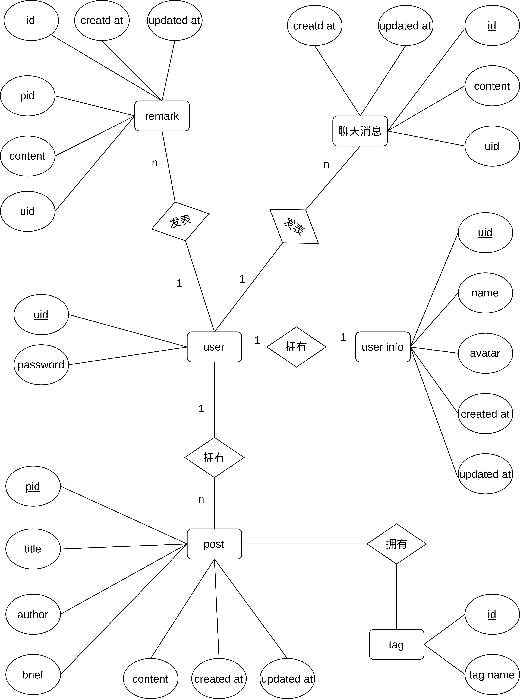

# 三、系统架构设计 [徐建奇]

## 3.1 整体架构


在设计的时候主要考虑两方面的内容，一方面是用户相关的操作，一方面是文章相关的操作，剩下部分集中作为扩展内容（包括网站的信息相关和留言板相关），后续也能够随着新内容部的引入而从中分离出来。

鉴于在一些静态博客的框架上（如 Hexo）不具备这种实时的互动，用户模块的设计初衷在于让用户间能够进行一些互动，分享心得体会。最初设计的时候用户仅有博主通过后端脚本进行发布文章，其他用户仅有评论和留言的权限，后续为了让该系统更加亲民，任何专业的用户都能体验完整的功能，让发布文章能够通过前端进行，于是干脆在这部分的设计上让所有用户都具有了发布文章的权利，该个人博客也会逐渐演化为了论坛的形式。当然为了与最初的方案统一，最终还是以个人博客的形式呈现，限制了仅有特定的用户能够发布文章，但为后续向论坛的形式进行改进保留了空间。

文章的检索是一个较为重要的内容，原本计划上设计了标签(tag)以及分类(category)两个属性来作为不同的检索依据，后来认为在个人博客的结构中，这两个属性的重叠度较高，基于设计简单的原则，保留了标签。同样的，在后续的迭代中，可能仍然会重新将分类这个检索依据重新加上。

在资源存储方面，考虑需要对图片等二进制文件进行存储，在建立数据库的基础上建立了图床以便让用户更加方便地构建起头像、相册等功能。

## 3.2 前端

!todo

## 3.3 后端

选择 Rust Axum 作为后端 Web 框架的原因有很多，这些原因包括了主观因素和客观事实，并充分利用了 Rust 语言的优势。下面将对这些原因进行简单阐释：

1. **内存管理严格**：Rust 对内存管理非常严格，通过其独特的所有权系统和借用检查器，避免了内存泄漏问题，提供了更好的内存安全保障。
2. **运行速度快**：Rust 通过将代码编译成机器码来运行，避免了 Java 虚拟机运行和 Python 解释运行带来的开销，同时在无垃圾回收机制（GC）的内存管理体系下，Rust 的执行效率理论上更高。
3. **高并发支持**：Rust 非常适合高并发编程。它具备数据无竞争和安全高效的线程通信等优势。此外，Rust 还拥有像 Tokio 这样的优秀异步编程库，进一步增强了其在并发编程中的表现。

数据库上选择了 MariaDB。主要考虑了其易用以及兼容性，是 MySql 的一个分支，其次由于在 debian 12 系统中默认安装了 MariaDB，而 MySql 不在 apt 源中，因此使用了 MariaDB 作为数据库。

# 四、API设计 [徐建奇]

该部分在设计的时候采取了类似面向对象的方式，路由的第一级表示要操作的`对象`，第二级表示对该对象采取的`动作`。

参照`三、系统架构设计`中描述的，主要分为两类对象，用户和文章，其他零碎的部分则是仅有一级，当然随着后续功能的加入也会分离出对应的对象。

因此在设计此 API 时，遵循了以下原则：

1. **模块化设计**：将功能划分为独立的模块，以便于管理和扩展。
2. **简洁易用**：API 的设计尽量简洁，参数和返回值清晰明了，便于开发者使用。
3. **安全性**：确保敏感操作（如用户信息更新、文章管理等）需要身份验证，保护用户数据。
4. **高性能**：通过优化数据结构和查询，确保 API 的高性能响应，满足高并发请求的需求。
5. **扩展性**：设计考虑到未来的扩展需求，确保可以方便地增加新功能和模块。

## 4.1 用户模块

包括常规的注册、注销、登陆、修改信息、查询信息操作以及发布文章、评论、留言这些特定的操作。

## 4.2 文章模块

文章模块是系统的核心部分，涵盖了创建、删除、更新、获取文章内容、获取文章信息列表、获取文章的评论列表功能。

## 4.3 扩展

扩展部分包括网站的基本信息管理（查看信息和修改信息）、留言板功能（查看留言板列表）、上传文件和静态文件访问。

> **网站信息**:
> 此功能用于获取和更新网站的基本信息，包括标题、副标题、描述、作者等内容，以及一些社交媒体的链接。

## 4.4 API 表单

| 路由 | 说明 |
| --- | --- |
| `/post/create` | 创建一篇文章 |
| `/post/delete` | 删除一篇文章 |
| `/post/update` | 更新一篇文章 |
| `/post/content` | 得到文章内容 |
| `/post/infolist` | 得到文章列表 |
| `/post/remarks` | 得到文章对应的评论内容 |
| `/user/register` | 注册一名用户 |
| `/user/delete` | 注销一名用户 |
| `/user/update` | 更新用户信息 |
| `/user/login` | 用户登陆 |
| `/user/info` | 得到用户信息 |
| `/user/remark` | 用户发表评论 |
| `/user/chat` | 用户留言 |
| `/chatlist` | 留言板消息列表 |
| `/upload` | 上传文件 |
| `/resouce/{file/path}` | 静态文件访问 |
| `/basicinfo` | 获取网站信息 |
| `/updateinfo` | 更新网站信息 |

## 4.5 API 使用及测试

### Base URL

http://124.223.209.159:8300/api

### Routes

#### `/post`

##### Create Post

- **Description**: 创建一篇文章
- **URL**: `/post/create`
- **Method**: POST
- **Request Body**:
```json
{
   "title": "test",
   "author": 100000,
   "brief": "广告招租位",
   "content": "test",
   "tags": ["广告", "测试"]
}
```
- **Response**:
  - **Status**: 200 OK 

##### Delete Post

- **Description**: 删除一篇文章
- **URL**: `/post/delete`
- **Method**: POST
- **Request Body**:
```json
{
  "pid": "f354c332-a2ad-42a6-bdae-99b535395ef1"
}
```
- **Response**:
  - **Status**: 200 OK / 500 Internal Server Error
  - **Error Message**:
    ```json
    "Data Not Found in database"
    ```

##### Update Post

- **Description**: 更新一篇文章
- **URL**: `/post/update`
- **Method**: POST
- **Request Body**:
```json
{
  "pid": "dfebd659-9cd2-4c9a-8a42-85fbf561bd9a",
  "title": "update",
  "brief": "广告招租位update",
  "content": "更新！！！！",
  "tags": ["广告", "测试", "更新"]
}
```
- **Response**:
  - **Status**: 200 OK

##### List Post Information

- **Description**: 得到文章列表
- **URL**: `/post/infolist`
- **Method**: GET
- **Response**:
  - **Status**: 200 OK
  - **Body**:
  ```json
    [
      {
        "author": 100000,
        "brief": "广告招租位",
        "date": "2024-06-06T13:08:27Z",
        "pid": "283036ea-afe6-46df-bbb4-f47d10172114",
        "tags": ["广告", "测试"],
        "title": "test"
      },
      ...
    ]
  ```

##### Get Post Content

- **Description**: 得到文章内容
- **URL**: `/post/content`
- **Method**: GET
- **Query Parameters**:
  - `pid`: string
- **Response**:
  - **Status**: 200 OK
  - **Body**:
  ```
    Content 内容 String
  ```

##### List Post Remarks

- **Description**: 得到文章对应的评论内容
- **URL**: `/post/remarks`
- **Method**: GET
- **Query Parameters**:
  - `pid`: string
- **Response**:
  - **Status**: 200 OK
  - **Body**:
  ```json
    [
      {
        "content": "remark",
        "created_at": "2024-06-06T13:08:27Z",
        "uid": 10000000
      },
      ...
    ]
  ```


#### `/user`

##### Register User

- **Description**: 注册一名用户
- **URL**: `/user/register`
- **Method**: POST
- **Request Body**:
```json
{
  "name": "username",
  "passwd": "password"
}
```
- **Response**:
  - **Status**: 200 OK
  - **Body**: 
   ```json
    uid
   ```

##### Delete User

- **Description**: 注销一名用户
- **URL**: `/user/delete`
- **Method**: POST
- **Request Body**:
```json
{
  "uid": 10000002
}
```
- **Response**:
  - **Status**: 200 OK
  
##### Update User

- **Description**: 更新用户信息
- **URL**: `/user/update`
- **Method**: POST
- **Request Body**:
```json
{
  "uid": 10000000,
  "passwd": "root",
  "name": "root",
  "avatar": null,
  "bio": null
}
```
- **Response**:
  - **Status**: 200 OK

##### User Login

- **Description**: 用户登陆
- **URL**: `/user/login`
- **Method**: POST
- **Request Body**:
```json
{
  "uid": 10000000,
  "passwd": "root"
}
```
- **Response**:
  - **Status**: 200 OK / 500 Internal Server Error
  - **Body**:
    - Success:
    ```json
    {
      "code": 1,
      "userinfo": {
        "avatar": null,
        "bio": null,
        "created_at": "2024-06-06T07:47:26Z",
        "name": "root",
        "uid": 10000000
      }
    }
    ```
    - Failure:
    ```json
    {
      "code": 0,
      "userinfo": null
    }
    ```
    - Error Message:
    ```
    "User Not Found
    ```

##### User Info

- **Description**: 得到用户信息
- **URL**: `/user/info`
- **Method**: GET
- **Query Parameters**:
  - `uid`: int
- **Response**:
  - **Status**: 200 OK
  - **Body**: 
  ```json
   {
    "uid": 10000000,
    "name": "root",
    "avatar": null,
    "bio": null,
    "created_at": "2024-06-06T07:47:26Z"
  }
  ```

##### Add Remark

- **Description**: 用户发表评论
- **URL**: `/user/remark`
- **Method**: POST
- **Request Body**:
```json
{
  "uid": 10000000,
  "pid": "dfebd659-9cd2-4c9a-8a42-85fbf561bd9a",
  "content": "remark"
}
```
- **Response**:
  - **Status**: 200 OK

##### Add Chat

- **Description**: 用户聊天
- **URL**: `/user/chat`
- **Method**: POST
- **Request Body**:
```json
{
  "uid": 10000000,
  "content": "chat"
}
```
- **Response**:
  - **Status**: 200 OK


#### `/chatlist`

- **Description**: 聊天消息列表
- **URL**: `/chatlist`
- **Method**: GET
- **Request Body**:
```json
{
  "uid": 10000000,
  "content": "chat"
}
```
- **Response**:
  - **Status**: 200 OK
  - **Body**:
  ```json
  [
    {
      "content": "chat",
      "created_at": "2024-06-06T12:55:05Z",
      "uid": 10000000
    },
    ...
  ]
  ```

#### Upload

- **Description**: 上传文件
- **URL**: `/upload`
- **Method**: POST
- **Request Body**:
  - Content-Type: multipart/form-data
  - Fields:
    - file: 文件内容，类型为 file，即要上传的文件。
- **Response**:
  - **Status**: 200 OK

> ps: 传入的文件内容要求小于 2MB

#### resouce

- **Description**: 静态文件访问
- **URL**: `/resouce/{file/path}`
- **Method**: GET
- **Response**:
  - **Status**: 200 OK


#### basic_info

- **Description**: 网站信息
- **URL**: `/basicinfo`
- **Method**: GET
- **Response**:
  - **Status**: 200 OK
  - **Body**:
  ```json
  {
    "sitebasicinfo": {
      "title": "",
      "subtitle": "",
      "description": "",
      "author": "",
      "favicon": "",
      "avatar": ""
    },
    "mylinks": {
      "github": "",
      "bilibili": "",
      "zhihu": "",
      "qq": "",
      "wechat": null,
      "gitee": ""
    }
  }
  ```

#### basic_info_update

- **Description**: 更新网站信息
- **URL**: `/updateinfo`
- **Method**: POST
- **Request Body**:
```json
{
  "sitebasicinfo": {
    "title": "",
    "subtitle": "",
    "description": "",
    "author": "",
    "favicon": "",
    "avatar": ""
  },
  "mylinks": {
    "github": "",
    "bilibili": "",
    "zhihu": "",
    "qq": "",
    "wechat": null,
    "gitee": ""
  }
}
```
- **Response**:
  - **Status**: 200 OK

# 五、数据库设计 [徐建奇]

本数据库设计旨在支持一个包含用户管理、文章发布与评论、用户互动等功能的全功能应用，包括七张主要的表：`users`、`user_infos`、`posts`、`remarks`、`chat_messages`、`post_tag`、`tag_set`。以下是对数据库表结构及其设计原理的详细解释。

## 5.1 设计原则与优势

在数据库设计过程中，遵循了以下原则和优势：

1. **规范化设计**：通过合适的表结构和关联，确保数据存储的有效性和一致性。
2. **扩展性**：使用标准的多对多关系模式和自增主键，方便未来系统功能的扩展和改进。
3. **性能优化**：合理使用索引和优化查询，提升系统在大规模数据处理和高并发访问时的性能表现。
4. **可维护性**：使用时间戳字段追踪数据修改历史，便于故障排查和数据修复。
5. **不设置外键**：提高了效率、灵活性和扩展性，相应的限制在后端代码中实现。

## 5.2 数据库表描述

### 用户相关表格

**1. `users` 表格**

```sql
CREATE TABLE `users` (
    `uid` INT UNSIGNED AUTO_INCREMENT PRIMARY KEY,
    `passwd` VARCHAR(255) NOT NULL
) AUTO_INCREMENT=10000000;
```

- **设计目的**：存储用户的基本身份信息，`uid` 为用户唯一标识，自增长；`passwd` 存储用户密码，确保用户数据的安全性。

**2. `user_infos` 表格**

```sql
CREATE TABLE `user_infos` (
    `uid` INT UNSIGNED PRIMARY KEY,
    `avatar` VARCHAR(255),
    `name` VARCHAR(255),
    `bio` TEXT DEFAULT NULL,
    `created_at` TIMESTAMP DEFAULT CURRENT_TIMESTAMP,
    `updated_at` TIMESTAMP DEFAULT CURRENT_TIMESTAMP ON UPDATE CURRENT_TIMESTAMP
);
```

- **设计目的**：存储用户的详细信息，包括头像路径、用户名、个人简介等。
- **关联性**：与 `users` 表通过 `uid` 建立一对一关系，确保用户信息的完整性和一致性。
- **时间戳字段**：`created_at` 记录用户创建时间，`updated_at` 记录最后更新时间，用于数据版本控制和审计。

### 文章及评论相关表格

**3. `posts` 表格**

```sql
CREATE TABLE `posts` (
    `pid` uuid NOT NULL DEFAULT uuid() PRIMARY KEY,
    `title` varchar(255) NOT NULL,
    `author` INT UNSIGNED,
    `brief` text NOT NULL DEFAULT '暂无简介',
    `content` longtext DEFAULT NULL,
    `created_at` timestamp NULL DEFAULT current_timestamp(),
    `updated_at` timestamp NULL DEFAULT current_timestamp() ON UPDATE current_timestamp()
);
```

- **设计目的**：存储用户发布的文章信息，包括标题、作者、简介和内容。
- **关联性**：`author` 字段关联到 `users` 表的 `uid`，建立作者与文章之间的关系。
- **时间戳字段**：`created_at` 记录文章创建时间，`updated_at` 记录最后更新时间，便于文章版本管理和时间排序。

**4. `remarks` 表格**

```sql
CREATE TABLE `remarks` (
  `id` INT UNSIGNED NOT NULL AUTO_INCREMENT PRIMARY KEY,
  `uid` INT UNSIGNED DEFAULT NULL,
  `pid` uuid DEFAULT NULL,
  `content` text DEFAULT NULL,
  `created_at` timestamp NULL DEFAULT current_timestamp(),
  `updated_at` timestamp NULL DEFAULT current_timestamp() ON UPDATE current_timestamp()
) AUTO_INCREMENT=0;
```

- **设计目的**：存储文章的评论信息，包括评论内容、评论者 ID (`uid`) 和文章 ID (`pid`)。
- **时间戳字段**：`created_at` 记录评论创建时间，`updated_at` 记录最后更新时间，用于评论排序和版本控制。

**5. `chat_messages` 表格**

```sql
CREATE TABLE `chat_messages` (
  `id` INT UNSIGNED NOT NULL AUTO_INCREMENT PRIMARY KEY,
  `uid` INT UNSIGNED DEFAULT NULL,
  `content` text DEFAULT NULL,
  `created_at` timestamp NULL DEFAULT current_timestamp(),
  `updated_at` timestamp NULL DEFAULT current_timestamp() ON UPDATE current_timestamp()
) AUTO_INCREMENT=0;
```
- **设计目的**：存储留言板信息，包括留言内容、留言者 ID (`uid`) 。
- **时间戳字段**：`created_at` 记录留言创建时间，`updated_at` 记录最后更新时间，用于留言排序和版本控制。

### 辅助表格

**6. `post_tag` 表格**

```sql
CREATE TABLE `post_tag` (
  `pid` uuid NOT NULL,
  `tag` INT UNSIGNED NOT NULL,
  PRIMARY KEY (`tag`,`pid`)
);
```

- **设计目的**：实现文章与标签的多对多关系，存储每篇文章的标签信息。
- **复合主键**：使用 (`tag`, `pid`) 作为复合主键，确保同一文章不会有重复的标签，同时优化标签的检索和管理效率。

**7. `tag_set` 表格**

```sql
CREATE TABLE `tag_set` (
  `id` INT UNSIGNED NOT NULL AUTO_INCREMENT PRIMARY KEY,
  `tag` varchar(255) NOT NULL
) AUTO_INCREMENT=0;
```

- **设计目的**：存储系统中所有可能的标签，保证标签的唯一性和统一管理。
- **自增主键**：使用 `id` 作为自增长的主键，确保每个标签都有唯一的标识符。

## 5.3 ER 图



# 七、后端服务器的实现 [徐建奇]

本部分将详细介绍后端服务器的实现，包括用户模块、文章模块以及扩展功能。

## 7.1 用户模块

本模块实现了用户的注册、删除、更新信息、登录认证、发表评论、留言消息发送以及查询用户信息等核心功能。设计时着重考虑了安全性、效率与可扩展性，通过 RESTful API 接口的形式提供服务。利用 Arc 保证状态的线程安全共享，以及 Serde 进行 JSON 序列化/反序列化。

### 实现考虑因素

1. **安全性**：
   - 密码在存储和传输过程中均应加密处理，实际应用中需采用哈希等方式存储。
   - API 接口使用 HTTPS 以确保数据传输安全。
   - 输入验证：对所有入参进行合法性检查，防止SQL注入等安全问题。

2. **效率**：
   - 异步操作：使用 `.await` 关键字进行数据库操作，充分利用异步 IO 提高并发处理能力。
   - 状态共享：通过 `Arc<AppState>` 在多个处理函数间共享数据库连接池等资源，减少重复初始化开销。

3. **可扩展性**：
   - 分层架构：清晰分离路由处理逻辑与业务逻辑，易于添加新功能或调整现有功能。
   - 数据模型抽象：如`User`结构体的设计，便于后续扩展用户属性。

### 算法说明

- **注册**：通过用户名和密码创建新用户记录，返回新用户ID。
- **删除用户**：根据用户 ID 删除用户记录。
- **更新用户信息**：支持修改密码、用户名、头像和简介，根据用户 ID 执行更新操作。
- **登录**：验证用户 ID 和密码是否匹配，成功后返回包含用户信息的响应。
- **发表评论**：关联用户ID、文章ID和评论内容，向数据库插入新的评论记录。
- **发表留言**：记录用户ID和消息内容到留言消息表中。
- **查询用户信息**：根据用户ID获取并返回用户详细信息。

### 流程设计

1. **注册流程**:
   - 接收客户端注册请求（含用户名、密码）。
   - 验证用户名唯一性。
   - 插入新用户至数据库，返回用户ID。

2. **登录流程**:
   - 获取客户端登录请求（用户ID、密码）。
   - 验证用户ID和密码组合的有效性。
   - 成功则生成认证信息并响应给客户端。

3. **更新用户信息流程**:
   - 接收更新请求，包含用户ID及需要更新的字段。
   - 校验用户ID对应记录存在。
   - 更新数据库中的用户信息。

4. **其他操作**（删除、评论、聊天、查询信息）类似地，先验证请求参数的有效性，然后执行相应数据库操作，并根据操作结果返回响应。

以上流程均围绕着验证-处理-响应的基本模式展开，确保了操作的安全性和数据的一致性。

## 7.2 文章模块

文章模块提供了创建、删除、更新文章，获取文章列表、文章内容以及文章评论列表的功能。通过 RESTful 风格的接口设计。该模块与数据库交互紧密，利用异步操作优化响应时间，并通过 `Arc<AppState>` 确保状态在并发请求中的安全访问。

### 实现考虑因素

1. **资源管理**：利用`Uuid`生成唯一文章ID，确保每篇文章的标识性。
2. **数据一致性**：更新和删除操作前，验证文章ID的有效性，保持数据库数据的一致性。
3. **性能优化**：异步数据库操作减少阻塞，提升整体服务性能。
4. **用户体验**：提供文章列表、单独文章内容和评论列表的快速查询，增强用户互动体验。

### 算法说明

- **创建文章**：接收文章标题、作者 ID、简介、内容及标签列表，生成 UUID 作为文章 ID，将文章信息存储到数据库。
- **删除文章**：根据文章 ID 从数据库中删除指定文章。
- **更新文章**：允许修改文章的标题、简介、内容和标签，基于文章 ID 定位并更新数据库记录。
- **文章列表查询**：从数据库获取全部文章信息，包括额外调用以打包每篇文章的关联标签。
- **文章内容查询**：根据文章 ID 检索并返回文章的完整内容。
- **评论列表查询**：根据文章 ID 列出与之相关的所有评论。

### 流程设计

1. **创建文章流程**:
   - 客户端发送包含文章详情的请求。
   - 服务器生成文章ID，保存文章信息至数据库。
   - 返回操作成功响应。

2. **删除文章流程**:
   - 客户端提供文章ID发起删除请求。
   - 服务器验证ID有效性，删除对应文章记录。
   - 返回操作结果。

3. **更新文章流程**:
   - 收到包含更新信息的请求，包括文章ID和其他更新字段。
   - 根据ID定位文章，更新指定字段。
   - 确认更新操作成功并响应。

4. **文章列表查询流程**:
   - 客户端请求获取文章列表。
   - 服务器查询数据库获取文章基本信息，进一步查询并附加每篇文章的标签。
   - 封装完整信息后返回给客户端。

5. **文章内容查询与评论列表查询**:
   - 客户端根据文章ID请求特定内容或评论列表。
   - 服务器查询并直接返回请求的信息。

此模块设计充分考虑了后端服务的高效性与数据处理的灵活性，为前端应用提供了坚实的数据支撑。

## 7.3 静态资源上传以及访问

静态资源上传及访问模块提供了上传文件到服务器以及通过 HTTP 访问这些资源的功能。该模块利用 Axum 的多部分表单解析来处理文件上传请求，并使用 Tokio 的文件 I/O 异步操作来保存上传的文件。同时，通过集成 ServeDir 中间件，允许通过一个预定义的路由（如`/resource`）直接访问这些静态资源，适用于存放和分享图片、文档等多种类型的文件。

### 功能描述

- **文件上传**
  - **接口**：通过POST方法上传多部分表单数据。
  - **逻辑**：接收多部分表单中的文件，将其保存到服务器的指定目录（默认为`./res/`）。
  - **输入**：多部分表单数据，每个部分代表一个文件。
  - **输出**：上传成功响应或错误信息。

- **资源访问**
  - **接口**：`/resource`
  - **功能**：通过该路由，客户端可以访问之前上传的静态资源文件。
  - **示例**：上传的文件名为`example.jpg`，访问路径则为`http://yourdomain.com/resource/example.jpg`。

### 实现细节

1. **文件上传处理**:
   - 使用`multipart`请求处理器接收上传的数据。
   - 循环遍历表单中的每个文件字段。
   - 获取文件名，并构造保存文件的完整路径。
   - 异步读取文件数据，并写入到服务器上的指定目录。
   - 错误处理：若文件创建失败，则返回`IOError`。

2. **静态资源服务配置**:
   - 利用Axum的`ServeDir`中间件，设置一个路由（例如`/resource`），指向存储静态资源的目录（`./res/`），使所有该目录下的文件可通过HTTP访问。

### 注意事项

- **安全性**：实际部署时应考虑对上传文件类型和大小的限制，防止恶意文件上传导致的安全风险。
- **资源清理**：定期清理或设定策略管理已上传文件，避免存储空间被无限制占用。
- **权限设置**：确保服务器上的资源目录权限设置正确，防止非授权访问。

通过此模块，应用程序能够方便地集成文件上传和分享功能，增强了用户体验和系统实用性。

## 7.4 缓冲

旨在提高系统响应速度和处理效率，特别是对于频繁访问但变更不频繁的远程数据。该模块通过预先加载远程数据至内存中建立缓冲区，当接收到数据修改请求时，不仅更新远程数据库，同时也同步更新内存中的数据副本，从而在后续请求中能直接从内存中快速提供最新数据，减少数据库访问延迟。

### 设计考虑

1. **数据预加载**：系统启动或按需时，主动从远程数据库拉取数据至本地内存，形成数据缓冲池。
2. **数据一致性**：确保内存中的数据副本与远程数据库中的数据保持一致，任何对数据库的修改操作都会即时反映到内存缓冲中。
3. **性能优化**：通过内存缓存，大幅度减少对远程数据库的访问次数，尤其是在高并发场景下，显著提升系统响应速度。
4. **资源管理**：合理分配内存空间，监控和限制缓冲区大小，防止内存溢出；同时，实现数据过期或淘汰策略，维护内存使用效率。

### 实现策略

- **初始化加载**：应用启动时，或根据业务需求，异步加载远程数据至内存中，可考虑分批加载以减少初次加载时的内存压力和等待时间。
- **双写机制**：对于数据修改操作（增删改），同时更新远程数据库和内存缓冲区，通常通过事务保证数据的一致性。
- **并发控制**：在多线程或多任务环境下，使用锁机制（如Mutex）控制工具，确保数据读写的线程安全。
- **缓存更新策略**：设计数据失效策略（如 LRU），定期或在缓存满时淘汰旧数据，保持缓冲区的高效利用和数据的新鲜度。

通过内存缓冲机制，系统能够在处理远程数据请求时达到更高的效率与响应速度，但同时也需关注资源管理与数据一致性问题，确保系统的稳定运行。

# 八、系统测试 [徐建奇]

## 8.1 单元测试

在本项目中，我们采用了 `httpc-test` 来对每个API进行测试。`httpc-test` 是一个轻量级的 HTTP 客户端测试工具，可以方便地编写和执行 HTTP 请求测试脚本，以确保 API 的正确性和稳定性。

### 编写测试脚本

针对每个 API 编写测试脚本，测试脚本包括了对不同 HTTP 方法（GET、POST 等）的请求，以及对请求参数和响应结果的验证。以下是部分测试脚本的示例：


### 测试结果


# 九、系统部署 [徐建奇]

该部分将介绍本项目的数据库以及前后端软件的部署。

## 9.1 环境配置

采用腾讯云服务器来部署所有的数据库及软件，操作系统为 Debian 12。


由于该服务器之前已经安装好了大部分环境，软件运行过程中需要的环境变量以 `.env` 的形式来管理，同时本人开发的平台也是 linux ，因此选择直接将软件直接运行在服务器上。

其次使用了 screen 这个终端复用程序将前后端分别运行起来，整体的结构如下：


screen 实际运行效果：


## 9.2 数据库部署

数据库部署使用 sqlx 脚手架完成，该软件通过访问文件夹下的 `.env` 中的 `DATABASE_URL` 变量在该位置创建、迁移和回滚数据库。

该脚手架会生成 `up.sql` 以及 `down.sql` 用来迁移、回滚数据库，这样可以确保数据库的版本控制和变更管理。

下面展示在本地调试过程中使用 sqlx-cli 的记录：


## 9.3 后端部署

rust 会像 C 一样生成二进制可执行文件，因此在本地 release 编译完成后将最后的可执行文件直接放在服务器上运行即可。

具体的操作步骤如下：

1. 在本地执行 cargo build --release 命令生成可执行文件。
2. 使用 sftp 命令将生成的文件上传到服务器指定目录。
3. 在服务器上通过 screen 工具新建一个会话，并在该会话中运行可执行文件。

以下是服务器上运行后端服务的截图：


## 9.4 前端部署

前端部分采用了 http-server 进行简单的静态文件托管。http-server 是一个轻量级的静态文件服务器，可以通过 npm 进行安装和使用，非常适合快速部署和测试前端项目。

具体的操作步骤如下：

1. 在本地安装 http-server：`npm install -g http-server`
2. 将前端构建好的静态文件上传到服务器指定目录。
3. 使用 screen 工具新建一个会话，并在该会话中运行 `http-server` 命令，指定静态文件目录。

以下是前端服务运行的截图：


# 十一、清单 [徐建奇]

- 后端代码 site_server 项目
- !todo

# 十三、参考文献 [徐建奇]

- Axum 文档: https://docs.rs/axum/latest/axum/
- Axum Web App Production Code：https://github.com/jeremychone-channel/rust-axum-course
- Sqlx 文档：https://docs.rs/sqlx/latest/sqlx/